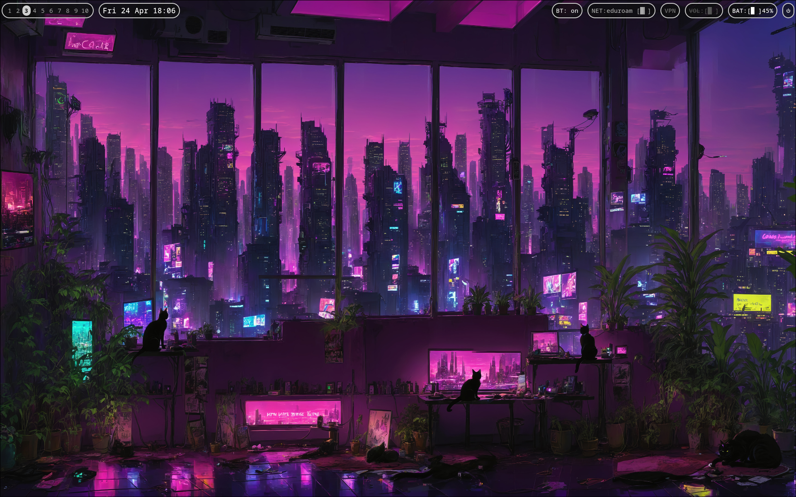
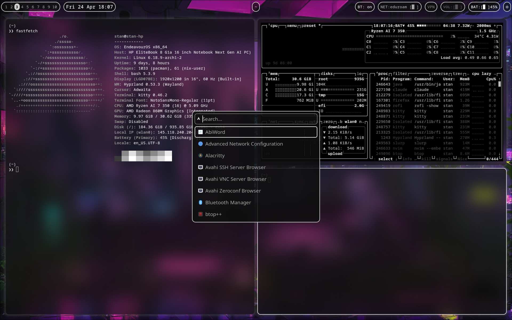
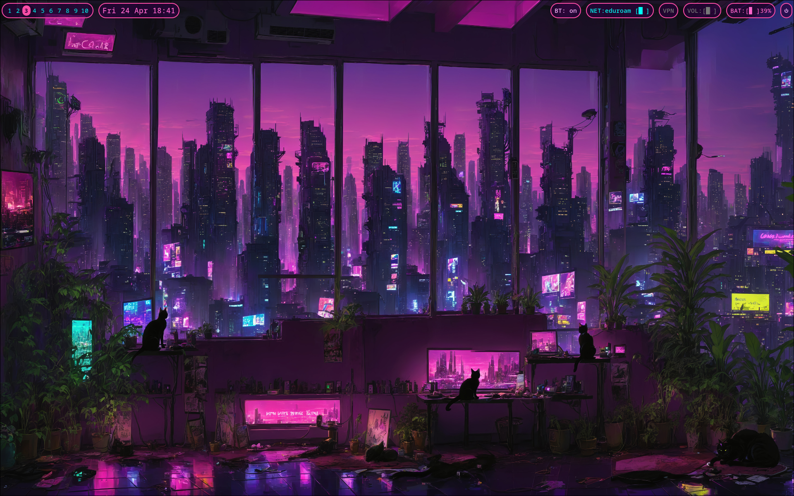
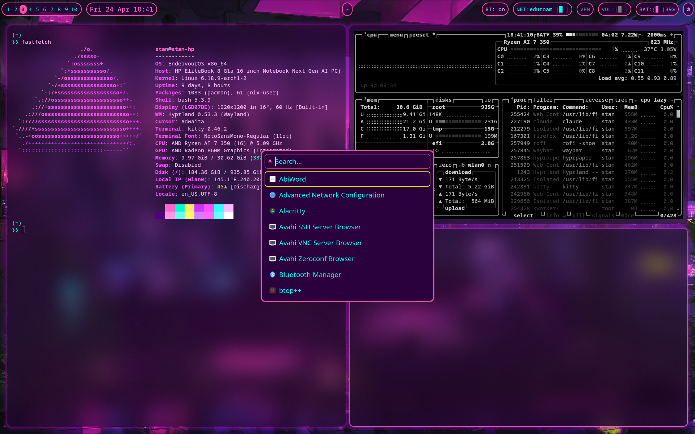

# dotfiles

My configuration files for my Hyprland-based Linux desktop. Still learning how to rice, so might be some bugs / ugly stuff.

I've opted for two themes. I'm a big sucker for neon and purple, so one theme is heavily inspired by the colour scheme of the ['Let you down' music video](https://www.youtube.com/watch?v=BnnbP7pCIvQ) from Cyberpunk. The other theme uses the same layouts, but is fully monochrome for a sharper look. They live in their own subdir

## Showcase

### Mono

| Bare | btop · fastfetch · terminal · rofi |
|:---:|:---:|
|  |  |

### Neon

| Bare | btop · fastfetch · terminal · rofi |
|:---:|:---:|
|  |  |

## Theme switching and stow
I've organized each theme directory to contain the .config for all applications I'm using, and stowing this entire theme-dir. This is indeed also how the [switch-theme](./switch-theme.sh) script functions: it unstows the themes, and stows the new theme (and also kills and restarts all processes (e.g. waybar))

## Todos
Hmmm, not sure, really. Might update to have applications be the atomic building blocks, instead of theme? Will see. If you have suggestions, don't hestitate to let me know!
